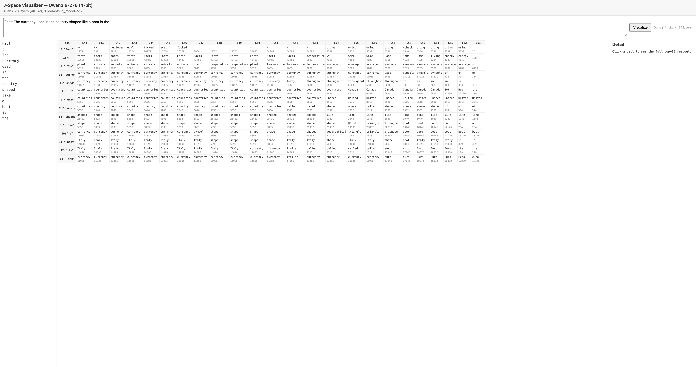

# jlens-qwen36

A **J-space / Jacobian-lens visualizer** for Qwen3.6-27B (4-bit) on Apple Silicon, ported to Apple MLX.

Implements the technique from Anthropic's [*Verbalizable Representations Form a Global Workspace in Language Models*](https://transformer-circuits.pub/2026/workspace/index.html). The J-lens reads out what a residual-stream activation at any layer is "disposed to make the model say" — surfacing the model's internal, unspoken concepts as a ranked list of vocabulary tokens.



## Status — what this is and isn't

**This is a working, end-to-portable implementation** of the J-lens
technique for Qwen3.6-27B (4-bit) on Apple Silicon. It is **not a
research-grade reproduction** of the Anthropic paper's results.

### Two lens versions

| Version | Prompts | Layers | Status | Where |
|---------|---------|--------|--------|-------|
| **v0.1-demo** (underfit) | 12 | 23 (L40–L62) | ✅ available now | [GitHub release](https://github.com/WeZZard/jlens-qwen36/releases/tag/v0.1-demo) |
| **v0.2-fulldepth** (better) | 20 | 64 (L0–L62) | ⏳ fitting now, ETA ~12h | will be published as a release |

The **underfit v0.1-demo** lens is what you get from the pre-fitted
download. It reproduces the core readout finding (internal concepts
surfacing in the J-space) but has noise and weak interventions. The
**full-depth v0.2** will cover all layers (including early/mid workspace
range) with less noise, enabling the paper's workspace-level
experiments.

### Comparison to the paper

| | Paper (Sonnet 4.5) | This repo (Qwen3.6-27B-4bit) |
|---|---|---|
| Prompts for fit | 1000 (~100 usable) | 12 (v0.1) / 20 (v0.2) |
| Layer depth | full | 23 late layers (v0.1) / 64 full (v0.2) |
| J-lens vector magnitude | large (good interventions) | small (interventions subtle) |
| Workspace census / ablation | done | not yet run |
| Readout quality | clean | noisy artifacts (`____` in mid layers) |

**What works well:**
- The slice viewer (position × layer grid) with click-to-pin and top-10 detail.
- Baseline generation.
- The J-lens readouts on factual prompts (currency→euro, Italy as
  intermediate concept) — the core "internal concepts" finding.

**What's demo-quality:**
- Readout noise in mid layers (needs more prompts).
- Interventions (steer/swap/ablate) change the J-lens readout but barely
  change the model's output (needs a better-fit lens or the analytic
  attention branch — see `PERFORMANCE.md`).

**What's not done:**
- The paper's workspace-level experiments (census, whole-J-space ablation,
  reportability) — these need a full-depth, 100+ prompt lens.
- The g/β decay-gate path in the custom kernel (see Limitations below).

To upgrade from demo to research-grade, see `PERFORMANCE.md` for the
optimization path (analytic attention assembly → 100+ prompt fit).

## What it does

Given a prompt, the visualizer shows a **position × layer grid** where each cell is the top J-lens token at that (position, layer). This lets you watch the model's internal concepts evolve across layers:

- **Early layers**: echo / task-frame tokens (e.g. "currency")
- **Workspace layers**: intermediate concepts the model uses to reason (e.g. "Italy" for the boot-shaped country, before resolving to "euro")
- **Motor layers** (last few): the output token

For example, on `Fact: The currency used in the country shaped like a boot is the`, you see `currency` → `Italian` (L52) → `euro` (L57+) → `euro` (model output).

## Requirements

- **Apple Silicon Mac** (M1+/M-series) — MLX is Apple-only
- **~20 GB free RAM** (the 4-bit model is ~15 GB resident + working memory)
- **Python 3.12** (managed automatically by `uv`)
- **~15 GB disk** for the model (auto-downloads from HuggingFace on first run)

## Quick start

### Option A: use the pre-fitted lens (2 minutes)

A demo-quality J-lens (12 prompts, 23 late layers) is available as a
GitHub release asset. Download it and start the server:

```bash
# 1. Clone
git clone https://github.com/WeZZard/jlens-qwen36.git
cd jlens-qwen36

# 2. Install dependencies
uv sync

# 3. Download the pre-fitted lens (1.1 GB)
gh release download v0.1-demo --repo WeZZard/jlens-qwen36 \
  --pattern '*.npz' --dir data/lens/
mv data/lens/jlens-qwen3.6-27b-4bit-12prompt-23layer.npz data/lens/lens.npz

# 4. Launch the visualizer
uv run python -m uvicorn jlens_qwen.serve:app --host 127.0.0.1 --port 8765

# 5. Open http://127.0.0.1:8765/ in a browser
```

**What you get:** the slice grid, generation, and interventions all
work. Readouts are interpretable on factual prompts (currency→euro,
Italy as intermediate concept). Mid-layer noise and weak interventions —
see the Status section below for why.

**A full-depth version is coming.** A 20-prompt, all-64-layer lens is
being fitted and will be published as `v0.2-fulldepth` when ready.

### Option B: fit your own lens (hours)

```bash
# Default VJP fit — 25 late layers (L40-L62), ~5-8h:
uv run python scripts/run_fit.py --n-prompts 20 --n-layers 25 --layer-start 40

# Hybrid analytic fit — full 64-layer depth, ~10-12h (recommended;
# gives readouts at ALL layers including the workspace range):
uv run python -c "
from jlens_qwen.model import load
from jlens_qwen.fit_analytic import fit_analytic
from jlens_qwen.lens import JacobianLens
from jlens_qwen.prompts import load_prompts
model = load()
prompts = load_prompts(n=20, min_chars=150)
J = fit_analytic(model, prompts, source_layers=list(range(63)),
                 checkpoint_path='data/lens/lens.ckpt.npy')
JacobianLens(J, n_prompts=20, d_model=5120).save('data/lens/lens.npz')
"

# Then start the server (it auto-loads data/lens/lens.npz):
uv run python -m uvicorn jlens_qwen.serve:app --host 127.0.0.1 --port 8765
```

### Option C: no fit, use the logit lens (immediate, lowest quality)

```bash
git clone https://github.com/WeZZard/jlens-qwen36.git
cd jlens-qwen36 && uv sync
uv run python -m uvicorn jlens_qwen.serve:app --host 127.0.0.1 --port 8765
```

Works immediately. Only the last ~10 layers produce interpretable
readouts (J=I, no transport). Good for exploring the UI.

### The UI

- **Slice grid** (top): position × layer, top-1 J-lens token per cell.
  Click a cell to pin its token and see the top-10 readout.
- **Generate** (bottom): baseline generation from the prompt.
- **Intervene** (bottom): steer (inject a concept), swap (replace one
  concept with another), or ablate (remove the J-space), with a
  baseline-vs-intervened diff. Subtle with a 20-prompt lens; see
  Limitations.

## Using a different model

The default model is `mlx-community/Qwen3.6-27B-4bit`. To use a different MLX-quantized Qwen3.5-architecture model:

```bash
# Fit on a different model
uv run python scripts/run_fit.py --model-id mlx-community/Qwen3.6-35B-A3B-4bit

# Serve with that model + its lens
JLENS_MODEL=mlx-community/Qwen3.6-35B-A3B-4bit \
JLENS_PATH=data/lens/lens.npz \
uv run python -m uvicorn jlens_qwen.serve:app --port 8765
```

The code targets the **Qwen3.5 architecture** (`model_type: qwen3_5`), which has hybrid attention: 48 linear-attention (Gated DeltaNet) + 16 full-attention layers. The custom GDN backward kernel is required for the Jacobian fit to be tractable.

## How it works

The Jacobian lens (J-lens) at layer ℓ is a matrix `J_ℓ ∈ R^{d_model × d_model}` that maps a residual-stream activation `h_ℓ` into the final-layer basis, so that `softmax(W_U · norm(J_ℓ · h_ℓ))` gives vocabulary-token scores. It's the average input→output Jacobian of the network, averaged over a corpus of prompts.

**Fitting** computes `J_ℓ` for each source layer via the chain rule: `J_ℓ = J_{ℓ+1} · M_ℓ`, where `M_ℓ = ∂h_{ℓ+1}/∂h_ℓ` is one decoder layer's Jacobian. This avoids the expensive full-stack VJP for each source layer.

**The hard part** is the Gated DeltaNet (GDN) linear-attention layers: MLX's fused Metal kernel for GDN has no registered VJP, and the pure-Python ops fallback is ~22× slower. This project includes a **custom Metal backward kernel** for GDN (registered via `mx.custom_function`) that brings the backward to kernel speed. See `jlens_qwen/custom_gdn_vjp.py`.

## Project layout

```
jlens_qwen/
  model.py             # MLX LensModel adapter (captures per-layer residuals, generate)
  patch_gdn.py         # Force GDN ops fallback + mx.checkpoint
  gdn_backward.py      # Manual BPTT backward through GDN (reference, verified)
  custom_gdn_vjp.py    # Custom Metal GDN backward kernel (5x speedup)
  custom_gdn_patch.py  # Wire the custom VJP into GDN via mx.custom_function
  fit.py               # VJP-based chain-multiply fitting (slow, exact reference)
  fit_analytic.py      # Hybrid fit: analytic MLP + closed-form norm + VJP attn
  analytic.py          # Closed-form RMSNorm Jacobian (12000x faster)
  analytic_layer.py    # Analytic MLP Jacobian via Hadamard trick (77x faster)
  probing.py           # Unbiased Rademacher probing (interim ~10x, high variance)
  interventions.py     # J-lens vectors, steer, swap, ablate_topk
  lens.py              # JacobianLens: save / load / apply / transport
  prompts.py           # WikiText-103 + c4 corpus loader
  serve.py             # FastAPI backend (/api/lens, /api/slice, /generate, /intervene)
web/
  index.html           # Self-contained slice-vis UI (no build step)
scripts/
  run_fit.py           # CLI: fit a lens (VJP path)
  workspace_range.py   # CLI: classify layers as echo/workspace/motor
  run_experiments.py   # Paper experiments (spider→ant, inject lightning, etc.)
  smoke_model.py       # Test: model loads, VJP works
.handoff/              # Prompt files for external agents (analytic attn, g/β gap)
PERFORMANCE.md         # Consolidated optimization plan
PERFORMANCE_REVIEW.md  # Fable 5's review of the plan
data/lens/             # Fitted lenses + checkpoints (gitignored)
data/corpus/           # Cached prompts (gitignored)
```

## Performance

On an M4 Pro / 64 GB:
- **Default fit** (25 late layers × 20 prompts × 32-token, VJP path):
  ~5-8 hours. Checkpoints every prompt, resumes on restart.
- **Hybrid analytic fit** (full 64 layers × 20 prompts, analytic MLP +
  VJP attention): ~10-12 hours. Same checkpoint/resume. This is the path
  to full-depth readouts (needed for workspace-level findings).
- **Analytic attention branch** (in `.handoff/`, not yet implemented):
  would make the full 64-layer fit take ~1-2 hours. See `PERFORMANCE.md`.

Memory: ~15 GB for the model + ~6.6 GB for the full-depth checkpoint +
~2 GB working = ~24 GB peak. Fits comfortably in 32 GB; tested on 64 GB.

## Limitations

- **MLX only** — no CUDA / Linux support (MLX is Apple-only).
- **Qwen3.5 architecture only** — the custom GDN VJP is specific to this
  arch. Other MLX models (Llama, Mistral, etc. with standard attention)
  would work with the `patch_gdn` disabled but haven't been tested.
- **Future-summed cross-position terms included** — the fit computes the
  *future-summed* influence `Σ_{t≥s} d(h_{l+1}[t])/d(h_l[s])` averaged over
  valid source positions, matching the paper's J-lens definition ("at some
  point in the future"). This is the right object for readouts and
  interventions.
- **Lens quality depends on prompt count** — the paper uses 1000 prompts
  (~100 is "usable"). The default 20-prompt fit is demo-quality: readouts
  are interpretable but noisy (artifacts like `____` tokens in mid layers).
  For research-grade results, fit with `--n-prompts 100` or more. See
  `PERFORMANCE.md` for how to make this affordable.
- **Custom kernel drops g/β paths** — the Metal GDN backward kernel
  (`custom_gdn_vjp.py`) returns zeros for the gradients w.r.t. the decay
  gate `g` and update gate `β`, which are projections of the layer input.
  This means the fitted J-lens slightly underestimates the influence of
  current activity on future outputs through the decay-gate path. The
  ops-based backward (`gdn_backward.py`) includes these paths. Run
  `scripts/measure_gbeta_gap.py` (after writing it — see `.handoff/`) to
  quantify the gap.
- **Single-token concepts** — like the reference, the J-lens only
  identifies concepts that correspond to single vocabulary tokens.
  Multi-token concepts need the paper's extension (§App-multi-token).
- **Interventions are subtle with a 20-prompt lens** — the J-lens vectors
  `v_t = J_ℓᵀ @ W_U[t]` are small with a noisy lens, so steering barely
  changes the output. With a 100+ prompt lens or the analytic attention
  branch (see `PERFORMANCE.md`), interventions become reliable.

## Acknowledgements

Based on Anthropic's [jacobian-lens](https://github.com/anthropics/jacobian-lens) reference implementation (Apache-2.0) and the accompanying [paper](https://transformer-circuits.pub/2026/workspace/index.html). The GDN forward kernel is from [mlx-lm](https://github.com/ml-explore/mlx-lm); the backward kernel is original to this project.

## License

Apache-2.0. See [LICENSE](LICENSE).