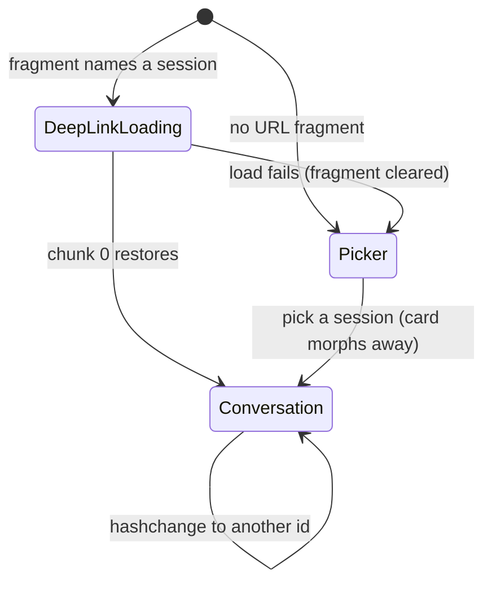
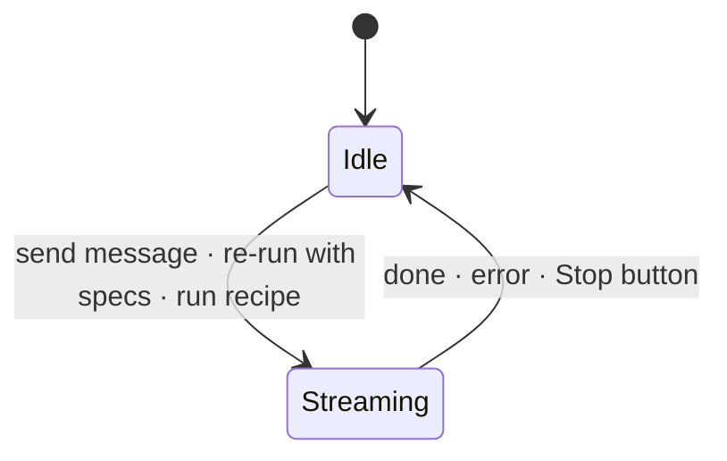
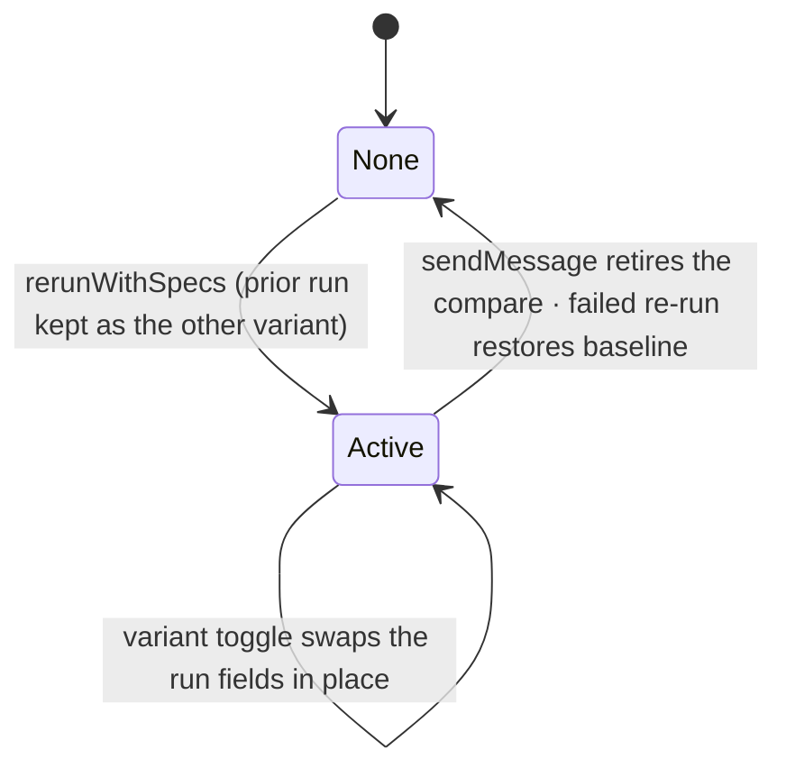
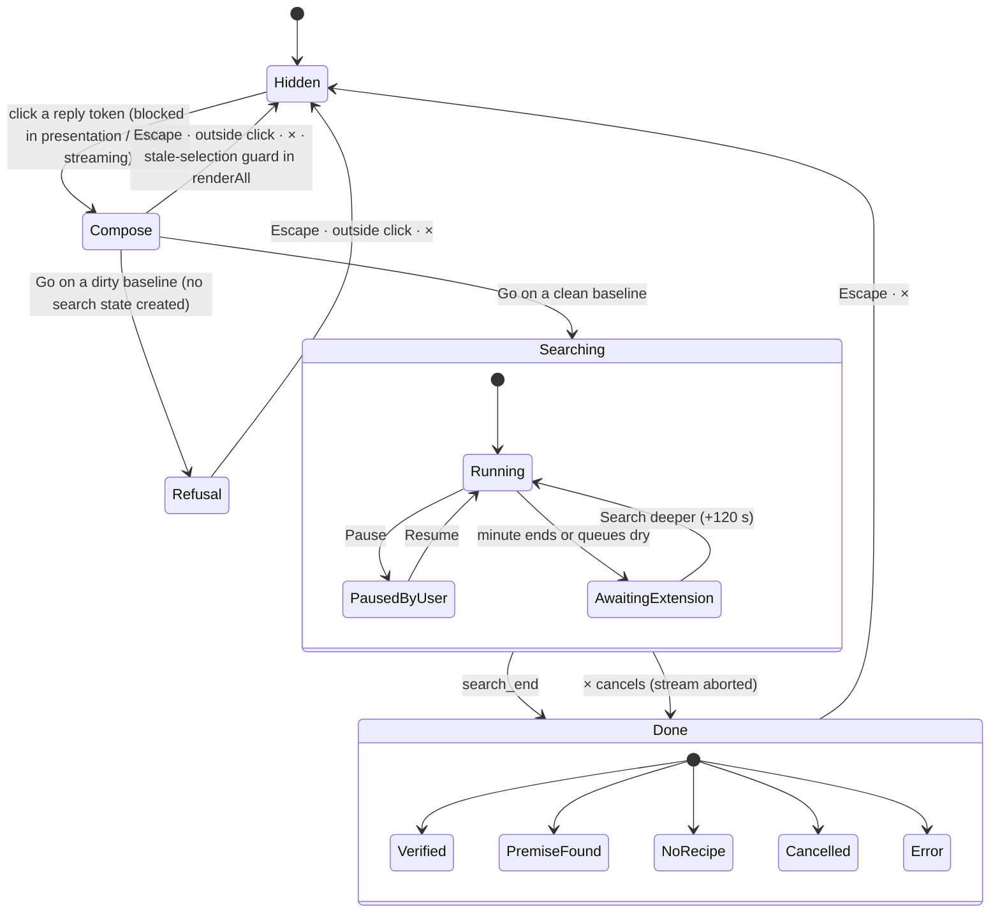
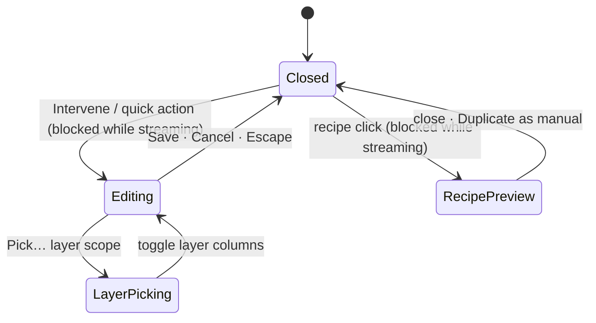

# Session-view UI state

The session view's modal UI is state-driven: one `ui` store owns which
surface holds the screen, `applyUiState()` derives every `<html>` class
and panel visibility flag from that store in a single pass, and handlers
request transitions instead of touching flags. This document records the
machine as implemented, the stores, the cross-machine rules, and the
defects the original mapping exposed (all fixed by the refactor; kept
below as design rationale).

The store has two tiers:

- `ui.mode` — exactly one screen-owning surface at a time: `normal`, the
  wish panel (`phase`: compose | refusal | searching | done), the
  intervention `editor` (with its layer-`picking` flag), the
  `recipePreview`, the legacy `scan`, or the presentation `picker`.
- `ui.popover` — at most one floating popover over any mode: `settings`
  or `sessionsMenu`.

Three transitions carry the cross-machine semantics:
`uiSetMode`/`uiSetPopover` (every entry/exit), and
`uiResetForConversationReplace()` — called by Clear, session loads, and
restores — which makes each machine answer the conversation being
replaced: a running search aborts its stream, an editor draft cancels,
popovers close, and the wish panel drops while its found recipes stay in
`state`. Escape pops the tiers: popover first, then the owning mode.

## Where state lives

| Store | Contents | Who resets it |
|---|---|---|
| `state` object (persisted to localStorage/server) | `messages`, `snapshots`, `gridRows`, `streaming`, `compare`, `interventions`, `appliedInterventions`, `interventionRecipes`, `selectedCell`/`selectedToken`, `markups`, `sourceSessionId`, settings | `clearState()`, `restoreConversation()` |
| Module globals (never persisted, untouched by `clearState`) | `_wish`, `_wishSeed`, `_wishSearchTimer`, `_ivDraft`, `_ivPreview`, `_ivRecipePreviewId`, `_pickerBusy`, `_sessionLoadGen`, stream abort controller | only their own handlers |
| `<html>` element classes | `presentation`, `picker-open`, `intervening`, `iv-picking`, `recipe-previewing`, `wish-search-active` | the handler that added each |
| Per-element DOM state | `#wish-pop` `hidden`/`search-mode`, `#chat-input` `wishing`/`streaming`, backdrop `visible` classes, `#wish-search-*` `hidden` attributes, `#share-btn` `hidden` | the handler that set each |

The split between row 1 and row 2 is the load-bearing problem: `clearState()`
resets the first store and believes it reset the UI, while the wish and
editor machines live entirely in the second, third, and fourth.

## Sub-machine 1 — deployment and entry

`JLENS_MODE` fixes `active` or `presentation` per deployment; it never
changes at runtime. Presentation entry:



Guards: `_pickerBusy` serializes picks; `_sessionLoadGen` supersedes an
in-flight load. Active mode skips this machine entirely and restores the
autosaved conversation.

## Sub-machine 2 — conversation run



`state.streaming` gates almost everything else: Clear, the wish entry,
the editor, recipe preview, session loads, and the settings-independent
re-run all refuse to start while it is true.

## Sub-machine 3 — A/B compare



The active variant's `appliedInterventions` feed the wish machine's
dirty-baseline guard, which is the one place two machines share a store
correctly (both read `state`).

## Sub-machine 4 — the wish panel ("Make it say")

The richest machine, and the one whose state is most scattered:
`_wishSeed` (compose target), `_wish` (committed wish), `_wish.search`
(the search object), `#wish-pop` visibility and `search-mode` class,
`#chat-input.wishing`, `html.wish-search-active`, and `_wishSearchTimer`.



Two guard subtleties define this machine's failure modes:

- The outside-click and cell-click dismissals are suppressed whenever
  `_wish.search` exists, to protect GPU work — including after `Done`,
  where no GPU work remains.
- `dismissWishPopover()` clears `_wishSeed` but never clears `_wish`.
  Every later guard that asks "is a modal search active?" reads
  `_wish.search` and therefore consults the previous interaction's
  finished search.

## Sub-machine 5 — intervention editor and recipe preview



Both editor states add `html.intervening`, which sinks the chat input and
both corner bars off-screen with `pointer-events: none` — so Clear, Saved
Sessions, and Settings are structurally unreachable while this machine is
open. This is the one cross-machine exclusion enforced by construction
rather than by a guard.

## Sub-machine 6 — selection and detail card

`state.selectedCell`/`selectedToken` drive the detail card. `selectCell`
and `closeDetailCard` both dismiss the wish panel unless `_wish.search`
exists — two more readers of the stale reference.

## Sub-machine 7 — transient popovers

Sessions menu, settings modal, and the legacy scan backdrop. The global
Escape handler encodes their priority as an ordered chain:

```text
scan backdrop → intervention editor → settings → sessions menu → wish panel
```

This priority list exists only inside that handler; no other code knows it.

## Cross-machine rules that exist today

| Event | Effect on other machines |
|---|---|
| Send message | Retires the compare; composer is hidden while the wish panel is open, so the two cannot race |
| Stream start | Blocks wish entry, editor, preview, Clear, session loads |
| Select a grid cell | Dismisses the wish panel — unless `_wish.search` exists |
| Run a recipe | Dismisses the wish panel and closes the editor explicitly |
| Open editor / preview | Makes Clear and the menus unreachable (`html.intervening`) |
| Escape | One ordered chain (above), one panel per press |
| Clear | Resets `state` only — see defects |
| Load a saved session | Replaces `state` only — see defects |

## Defects the original mapping exposed (fixed by the refactor)

**1. Clear does not reset the wish machine.** `clear-btn` calls
`clearState()` and `renderAll()`. `clearState()` touches only the `state`
store; `_wish`, the search stream, the timer, `#wish-pop`, and
`html.wish-search-active` all survive. `renderAll()` would dismiss the
panel through its stale-selection guard, but that guard is suppressed
whenever `_wish.search` exists — and `_wish` is never cleared, so after
any completed search in the session the guard is permanently suppressed.
Concretely:

- Compose panel open after an earlier search → Clear empties the chat
  but the "Make it say" panel stays (your report).
- Finished-search panel open → Clear empties the chat under it; the
  panel stays.
- Search running → Clear empties the conversation while the SSE stream
  and GPU replays continue against it, and the grid keeps its dimmed
  search overlay.

**2. Loading a saved session has the same hole.** `loadSession` replaces
the conversation through `restoreConversation()` + `renderAll()` and
never touches the wish or editor globals, so a stale panel — or a live
search — survives into an unrelated conversation.

**3. `_wish` outlives its panel by design.** The dismissal path clears
the seed but keeps the wish so a finished search's recipes stay
addressable. Visibility guards and lifetime therefore disagree about what
`_wish.search` means: "GPU work to protect" versus "history to keep".

**4. Mode exclusivity is implicit.** Wish panel, editor, preview, picker,
menus, and settings are mutually exclusive in practice, but the exclusivity
is distributed across sunken-button CSS, backdrop click rules, per-handler
`if` guards, and the Escape chain — no single owner declares "the session
view is in exactly one of these modes".

## Deliberate behavior changes in the refactor

- Escape now pops the popover tier before the mode tier (previously the
  editor outranked settings in the chain); tiers make the priority a
  rule instead of a list.
- Opening the editor or the recipe preview dismisses an open wish panel
  (previously the panel sank with the chrome and reappeared later); the
  mode tier holds one surface at a time, and the panel's recipes remain
  in the rail.
- The wish panel's visibility and its search history are separate:
  `ui.mode` says what is on screen, while `_wish` keeps the finished
  search's data so recipes stay addressable after dismissal.
- The data plane is unchanged: `state.messages`, snapshots, the grid,
  compare, and selection keep their existing owners; `applyUiState()`
  reads `state.streaming` and `state.sourceSessionId` but never writes
  `state`.
